---

---

### Projects:

- **[NPTELPrep](https://github.com/theg1239/nptel-api)**  
  A project to make NPTEL course materials more accessible via an API available to everyone. Features a quiz platform: [https://nptelprep.in](https://nptelprep.in).

- **[Vimegle](https://github.com/theg1239/vimegle-web)**  
  P2P video, voice and text chat platform to make new friends: [https://vimegle.com](https://vimegle.com)

- **[acmdraws](https://github.com/theg1239/acmdraws-backend)**  
  I remade Skribbl.io on my club's SPA enrollments website

- **[Enrollments Dashboard]**  
  I helped build the dashboard for my club's enrollments website, it enhanced productivity by several fold and provided valuable features and insights.

- **[MARINE](https://github.com/MARINE-AI/MARINE)**
  I built a distributed microservice architecture platform to detect pirated content across the web as part of a hackathon over 3 days with my team.
  We won our track "Digital Security" for this project

- **[z0d1ak Blog](https://github.com/theg1239/z0d1ak)**  
  Rolled our own CTF blog website to post writeups without using a CMS (my first time using Drizzle!)

- **[Deepfake Detection](https://github.com/ACM-VIT/QualityWeek_DeepfakeDetection)**  
  Helped conduct a workshop and delivered a hands on session on how to train a model and infer it to detect if a person in a video clip is deepfaked.

- **[Mediasoup WebRTC Server](https://github.com/theg1239/mediasoup)**
  Built (WIP) a server for many to many web conferencing with support for screensharing, admin mode, breakout rooms and ensured it's highly scalable.

- **[NPTEL Agent](https://github.com/theg1239/nptel-agent)**  
  An agent to automate doing your NPTEL weekly assignments, built with Langgraph

- **[RE-DACT](https://github.com/theg1239/RE-DACT)**  
  NLP-based redaction tool. It generates synthetic data over sensitive information.

- **[Shogi Encryption](https://github.com/theg1239/shogiencryption)**  
  An algorithm that encodes and decodes files using Shogi moves.

- **[QRcodes](https://github.com/theg1239/QRcodes)**  
  A QR code generator that just works: [gen.cryptichunt.in](https://gen.cryptichunt.in)

- **[Gravitas Fetcher](https://github.com/theg1239/gravitas-fetcher)**  
  Fetches event seat registrations. Made it because I was tired of the Gravitas website: [track.cryptichunt.in](https://track.cryptichunt.in)

- **[Codex Portal](https://github.com/theg1239/codex-portal)**  
  A web portal for Codex Cryptum. Built in 2 days, no stress: [codexcryptum.acmvit.in](https://codexcryptum.acmvit.in)

- **[img2pdf](https://github.com/theg1239/img2pdf)**  
  A simple img2pdf website: [https://img2pdf.in](https://img2pdf.in).

- **[Instagram Messages Parser](https://github.com/theg1239/instagram-messages-parser)**  
  Ever wanted to reminisce your Instagram text messages in an Instagram-esque UI? Well, now you can.

- **[VTOP Autofeedback](https://github.com/theg1239/VTOP-autofeedback)**  
  When you really just want to get that feedback thing done in like 10 seconds.

- **[VTOP Activity](https://github.com/theg1239/VTOP-activity)**  
  I was so tired of being auto-logged out by VTOP.

- **[URL Shortener](https://github.com/theg1239/url-shortener)**  
  Automated Certificate Management dot today shortened URLs: [link.acm.today](https://link.acm.today)

- **[Meetings Dashboard](https://github.com/theg1239/meeting-dashboard)**  
  It's real-time: [acm.today](https://acm.today)

- and a lot more other cool stuff

---

